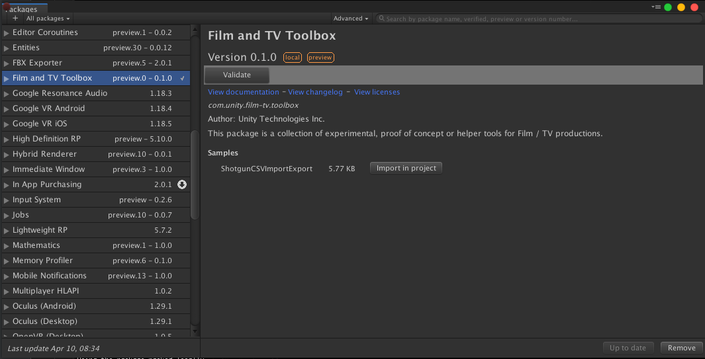
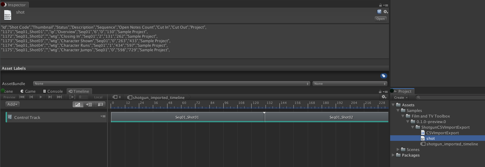

Unity Film / TV toolbox
=========================

This repository is a collection of experimental, proof of concept or helper tools for Film / TV productions.
 
Tools
=========================

Material Remapper
----------------------
Material Remapper allows to more easily assign material to models containing a lot of meshes (Alembic, etc).
It works with Legacy as well as SRP pipelines.

The tool was coded in large part by Mike Wutherick.

### How to Use

* Open the Material Remapper Window via `Window->Film-TV toolbox->Material Remapper`
* Select the root GameObject containing the MeshRenderers you want to set-up
* Click on "Update Scene Selection". This will load the list of unique MeshRenderers: 
* Add more materials to the session library by clicking "Add new Material Entry". Each new entry is initialized to the default current pipeline material.
* Replace the default materials with the wanted materials.
* Chose material assignments from the popup (Multiple materials per MeshRenderer are supported). 
* Once all assignments are configured, commit the changes to the Scene pressing "Apply Material Changes".
* If at any moment you wish to return to the default state of the Material Remapper, press ResetRemapper.

Alembic Material mapper
----------------------
One of the major downsides to using Alembic is the lack of material support in the format. In Unity, each alembic's materials must be managed independently in the scene that they alembic is being accessed, which makes iteration times very slow and painful.

The Alembic Material Mapper component attempts to provide an easy solution for this problem, by using a target game object (an fbx for example) as the 'lookdev' material source for all materials.

See [documentation](alembic-material-mapper.md).

Samples
==========================

Since 2019.1, samples can be imported via the Package Manager window (Window > Package Manager) :

If you are using a previous version, download the sample on [film-tv-toolbox repository](https://github.com/Unity-Technologies/film-tv-toolbox).

Shotgun CSV Import Export
--------------------------

This sample shows how to create a timeline in Unity using a shot sequence from a Shotgun CSV export and export back modifications.

### How to install

* Import the sample via Package Manager UI
* This will import in your Assets folder :
    * CSVImportExport.cs : a sample script demonstrating how to simply import / export a Shotgun CSV file
    * shot.csv : a shotgun csv export sample, used in the import.

### How to test

* Go to `Window > Film-TV toolbox > Samples > Shotgun` and select `Import CSV`
    * This creates a Timeline Asset (see shotgun_imported_timeline in the sample folder) from the `shot.csv` sample file :
    

* Make edits to the Timeline asset

* Go to `Window > Film-TV toolbox > Samples > Shotgun` and select `Export CSV`:
    * See export_from_unity.csv in the sample folder

### Limitations

* Having commas in fields (e.g.: `Opening sequence, part 2`) will confuse the parser
* Having duplicate column names will cause errors due to duplicate keys
